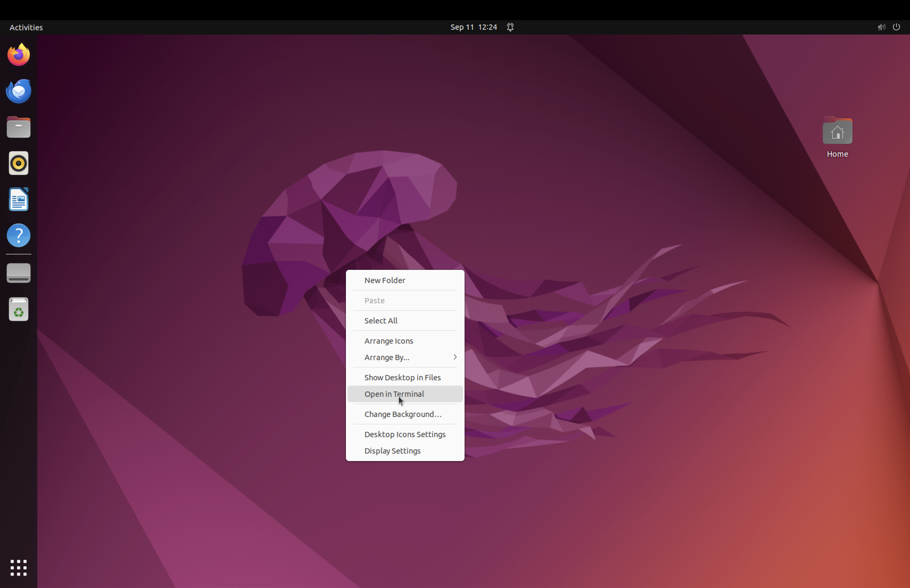
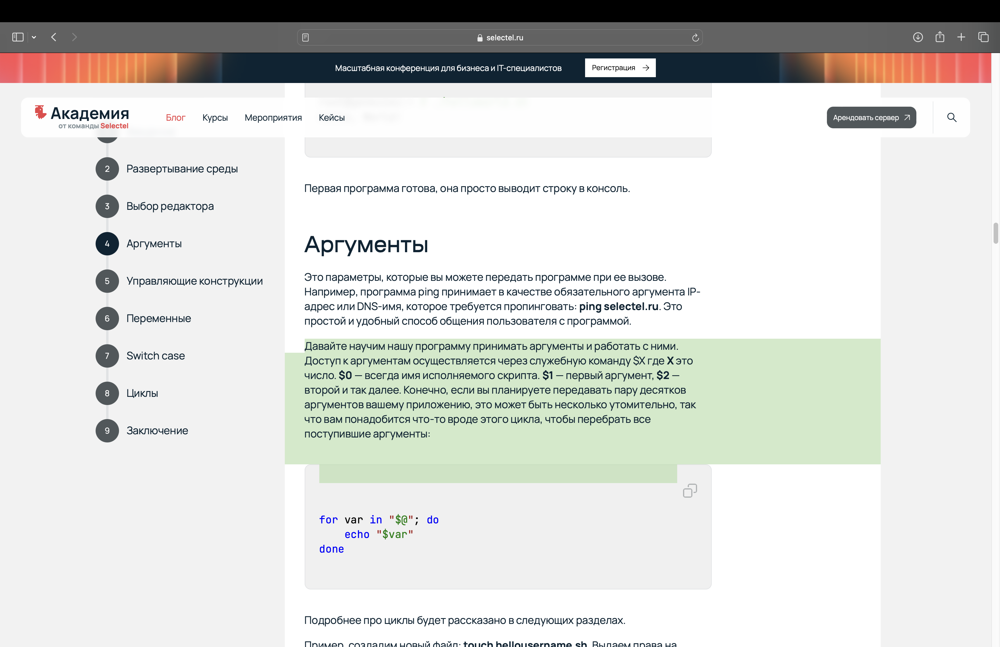

# Новицкая Елизавета К3162
 1) Я установила ubuntu через UTM на MacOs
 2) Далее вызвала терминал

 3) Через команду touch я создала файл script.bash

4) Через команду gedit я открыла файл в редакторе

5) В редакторе с помощью команды echo я написала "Welcome to ITMO University"

6) С помощью команды bash я вывела предложение в терминал

7) Для выполнения задачи я воспользовалась _руководством по написанию скриптов_ в *Linux Вash* на сайте selectel.ru

8) Я модифицировала текст и добавила аргумент $@, который относится ко всем последующим после него аргументам и выводит их на терминал 

9) Проверка с большим количеством аргументов

