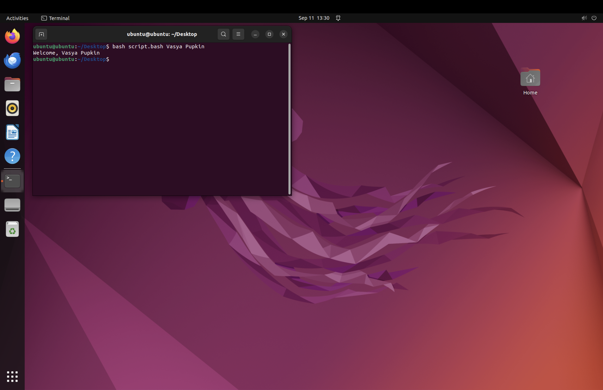

Новицкая Елизавета К3162

1)Я скачала Ubuntu через UTM на MacOs

2)Вызвала терминал

3)Создала файл script.bash через команду touch

4)Открыла созданный файл для редактирования через команду gedit

5)Прописала команду, выводящую предложение "Welcome to ITMO UNiversity"

6)Вывела предложение в терминале через команду bash

7)Для выполнения задачи я воспользовалась информацией с сайта selectel.ru, руководство по написанию скриптов Linux Bash

8)После слова "Welcome, " я ввела переменную $@, которая выведет все последущие слова после команды bash script.bash

9)Проверка на большее количество слов

